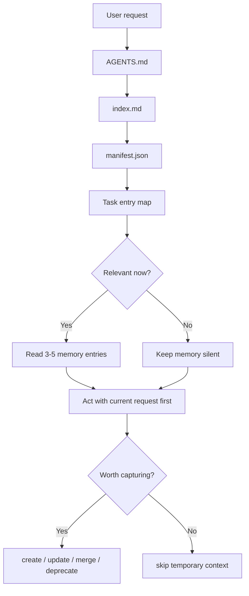

# Codex Second Brain

A local-first second brain for Codex: structured memory, task routing, forgetting rules, and reusable AI workflow knowledge.

这是一个面向 AI 的本地第二大脑系统。

它不是传统意义上给人浏览的知识库，也不是 Obsidian、在线文档或普通笔记目录，而是一个让 Codex 稳定读取、按需路由、长期复用的本地记忆系统。

它的目标很简单：让用户使用 Codex 更舒服、更省心、更少重复解释。

## The Short Story

I got tired of explaining the same project background, preferences, tool commands, and past mistakes to every new Codex thread.

So this project treats memory as a small local governance system:

- Codex starts from a few entry files.
- It reads the manifest instead of the whole library.
- It picks only the memories that match the current task.
- Old or uncertain memories are downgraded instead of silently steering future work.

The goal is not to make Codex remember everything. The goal is to help Codex know what matters now.

## How It Routes Memory



## It Solves

长期使用 AI 编程助手时，很多信息会反复出现：

- 用户偏好
- 项目背景
- 工具命令
- 踩坑经验
- 工作流边界
- 哪些记忆该用，哪些不该用
- 哪些旧规则应该遗忘或降权

这个项目把这些内容整理成 AI 可读的 Markdown + JSON 结构，让 Codex 可以先读索引，再按任务读取少量相关记忆，而不是每次重新解释，也不是全量塞进上下文。

## Core Ideas

- 本地优先：Markdown 和 JSON 是源数据。
- AI 优先：先服务 Codex 稳定读取，再考虑人类展示版。
- 按需读取：先读入口和索引，再读 3 到 5 个相关条目。
- 可治理：每条记忆有类型、状态、置信度、路径和摘要。
- 会遗忘：支持 `active`、`draft`、`deprecated`、`superseded`。
- 有边界：自动化只能提醒、检查、生成 draft，不能偷偷改长期记忆。

## Why This Exists

There are already strong AI memory systems, semantic memory frameworks, Claude Code hook projects, and Obsidian-based second brains.

This repository intentionally takes a narrower path:

- It is not a vector database or agent memory backend.
- It is not an Obsidian vault automation system.
- It is not a full conversation capture pipeline.
- It is not trying to remember everything.

Instead, it is a small governance skeleton for Codex-readable memory:

- what should be remembered
- when memory should be activated
- when old memory should be ignored
- how to avoid dumping everything into context
- how to keep AI collaboration comfortable for the user

The opinion is simple: useful AI memory is not only storage and retrieval. It also needs routing, restraint, decay, and user-comfort boundaries.

## Example Use Case

You have a long-running project with its own style, commands, constraints, and recurring mistakes.

Without a second brain, every new AI thread starts cold:

```text
Here is the project.
Here is what we tried.
Here is what failed.
Here is how I like answers.
Here is what not to touch.
```

With this structure, Codex can start from:

```text
AGENTS.md -> index.md -> manifest.json -> 3 to 5 relevant entries
```

That means the assistant gets the right context without dragging the entire knowledge base into every task.

## Repository Layout

```text
.
├── AGENTS.md
├── README.md
├── index.md
├── manifest.example.json
├── 00_boot/
│   ├── routing-rules.md
│   └── task-entry-map.example.md
├── 01_protocols/
│   ├── knowledge-capture.md
│   ├── knowledge-worthiness-standard.md
│   ├── memory-decay-and-forgetting.md
│   └── automation-boundary.md
├── 02_principles/
│   ├── ai-first-memory.md
│   └── codex-comfort-north-star.md
├── 03_examples/
│   └── example-project-memory.md
├── 06_templates/
│   ├── ai-knowledge-card.md
│   ├── failure-case.md
│   └── tool-runbook.md
└── scripts/
    └── second-brain-health-check.ps1
```

## Quick Start

1. Clone this repository.
2. Rename `manifest.example.json` to `manifest.json`.
3. Keep `AGENTS.md`, `index.md`, and `manifest.json` as the default entry files.
4. Add your own project memories under a private folder or a private fork.
5. Do not put secrets, raw chats, tokens, browser profiles, or private documents into the public repository.

## Recommended Prompt

```text
Use this repository as my local AI second brain.
Start from AGENTS.md, index.md, and manifest.json.
Do not read everything.
Pick only 3 to 5 relevant entries based on the current task.
If my current request conflicts with old memory, follow my current request.
```

## Recommended GitHub Topics

```text
codex
ai-memory
second-brain
local-first
markdown
agent-memory
knowledge-management
ai-workflow
developer-tools
personal-knowledge-management
```

## What To Keep Private

Public repositories should not include:

- Real local paths
- Account information
- Tokens, cookies, keys, auth files
- Client or employer details
- Raw chats or meeting transcripts
- Private project workflows
- Personal data that can identify people or organizations

Use this repository as a public skeleton. Keep your real second brain private.

## One Sentence

Codex Second Brain is a long-term collaboration layer for Codex, not a decorative knowledge base.

## Social Post Draft

```text
I built a local second brain for Codex.

Not a vector database.
Not an Obsidian vault.
Not a system that tries to remember everything.

The problem I wanted to solve was simpler:

I do not want to explain the same project background, preferences, commands, and past mistakes to every new AI thread.

So I made a small local memory governance skeleton:

- AGENTS.md for behavior rules
- index.md for human/AI navigation
- manifest.json for machine routing
- task entry maps for common workflows
- active/draft/deprecated/superseded memory states
- capture rules so not everything becomes memory
- forgetting rules so old context does not pollute new work

The core idea:
Useful AI memory is not just storage and retrieval.
It also needs routing, restraint, decay, and user-comfort boundaries.

GitHub:
https://github.com/setuhelivag422-ctrl/codex-second-brain
```
